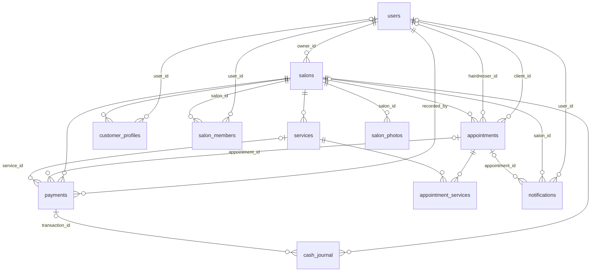

# backend/ — API CoifLink (FastAPI)

API REST du backend CoifLink, conformément à **[ADR-0003](../docs/adr/0003-backend-fastapi.md)**
(FastAPI · Python · REST + JWT). Le socle (issues #2–#6) installe l'architecture hexagonale,
la CI, le schéma PostgreSQL et la politique de secrets. L'**inscription client** (US-1.1, #8),
l'**inscription gérant** (#9, compte propriétaire de salon) et la **connexion JWT** (US-1.2, #10 —
émission d'un jeton d'accès + refresh, anti-bruteforce) sont les premières fonctionnalités M1 livrées
(salons, RDV, caisse… continuent en M1→).

## Architecture (hexagonale — [ADR-0008](../docs/adr/0008-architecture-hexagonale.md))

```
coiflink_api/
  domain/         # entités & règles métier (zéro dépendance framework/I/O)
  application/    # cas d'usage
    ports/        # interfaces (typing.Protocol)
  adapters/
    inbound/      # driving : routers HTTP FastAPI (ex. health.py → /health)
    outbound/     # driven : Postgres, Redis, S3, FCM/SMS (implémentent les ports)
  main.py         # composition root : assemble l'app + monte les routers
```

La dépendance va toujours **vers l'intérieur** ; toute brique externe passe par un
**port** + un adapter sortant (jamais d'import direct d'un client d'infra depuis le domaine).

## Prérequis

- **Python ≥ 3.12** (version de référence figée par #2 — cf. [ADR-0007](../docs/adr/0007-arborescence-monorepo-versions.md)).

## Installation (environnement isolé)

```bash
cd backend
python -m venv .venv
source .venv/bin/activate          # Windows : .venv\Scripts\activate
pip install -e ".[dev]"            # installe l'API + les outils de test
```

## Lancement (dev)

```bash
cp .env.example .env               # ignoré par git ; renseigner localement (aucun secret committé)
uvicorn coiflink_api.main:app --reload
```

L'API écoute alors sur `http://127.0.0.1:8000`. Endpoint de santé :

```bash
curl http://127.0.0.1:8000/health   # -> {"status":"ok"}
```

## Build & test

| Action | Commande |
| --- | --- |
| **Build** (installation du paquet) | `pip install -e .` |
| **Test** (test gate, cf. #6) | `pytest` |
| **Lint** (CI #4, cf. [ADR-0010](../docs/adr/0010-ci-cd-docker-packaging.md)) | `ruff check .` (installé via l'extra `dev`) |
| **Image Docker** (build-seul en CI ; config par env, non-root) | `docker build -t coiflink-backend ./backend` |

## Endpoints

| Méthode | Chemin | Réponse | Rôle |
| --- | --- | --- | --- |
| `GET` | `/health` | `{"status":"ok"}` | Sonde de santé (adapter entrant `adapters/inbound/health.py`) — aucune logique métier |
| `POST` | `/auth/register` | `201` + utilisateur (sans secret) | Inscription client (US-1.1, #8) — voir ci-dessous |
| `POST` | `/auth/register/manager` | `201` + utilisateur (sans secret) | Inscription gérant (compte propriétaire de salon, #9) — voir ci-dessous |
| `POST` | `/auth/login` | `200` + paire de jetons | Connexion (téléphone **ou** e-mail + mot de passe, US-1.2, #10) — voir ci-dessous |
| `POST` | `/auth/refresh` | `200` + paire de jetons | Rafraîchit le jeton d'accès depuis un refresh valide (#10) — voir ci-dessous |
| `POST` | `/auth/password/reset/request` | `202` + message générique | Demande un code de réinitialisation (SMS **ou** e-mail, US-1.3, #11) — voir ci-dessous |
| `POST` | `/auth/password/reset/confirm` | `200` + message générique | Confirme la réinitialisation (code + nouveau mot de passe, #11) — voir ci-dessous |
| `GET` | `/auth/me` | `200` + utilisateur (sans secret) | **Route protégée** — compte du porteur du jeton (#12) ; `Authorization: Bearer <access_token>` requis |
| `POST` | `/salons/{salon_id}/employees` | `201` + utilisateur (sans secret) | **Route protégée** — création d'un compte coiffeur rattaché au salon (US-1.4, #13) ; gérant du salon requis — voir ci-dessous |

> Toutes les routes ci-dessus **sauf `/auth/me` et `/salons/{salon_id}/employees`** sont
> **publiques** : elles constituent la liste d'exemption explicite du deny-by-default
> (`security.PUBLIC_ROUTE_PATHS`). **Toute route ajoutée est protégée par défaut** — voir
> « Autorisation & RBAC » ci-dessous.

## Authentification — inscription client (US-1.1, #8)

`POST /auth/register` crée un **compte client** (`role=CLIENT`, `status=ACTIVE`) à partir d'un
**nom**, d'un **numéro de téléphone** et d'un **mot de passe** (e-mail optionnel). Adapter entrant :
`adapters/inbound/auth.py` ; cas d'usage : `application/registration.py` (architecture hexagonale,
[ADR-0008](../docs/adr/0008-architecture-hexagonale.md)). Décisions de sécurité actées par
**[ADR-0012](../docs/adr/0012-hachage-argon2-strategie-otp.md)**.

- **Requête** (JSON) : `full_name` (requis), `phone` (requis), `password` (requis, ≥ 8 caractères),
  `email` (optionnel).
- **`201 Created`** : `{ id, full_name, phone, email, role, status, created_at }`. La réponse
  n'expose **jamais** `password` ni `password_hash`.
- **`409 Conflict`** : le numéro de téléphone (ou l'e-mail) est **déjà inscrit** (doublon refusé).
- **`422 Unprocessable Entity`** : validation (téléphone/mot de passe/e-mail invalides, champ manquant).

L'inscription **n'émet aucun JWT** (la connexion est l'issue #10).

**Sécurité & vie privée :**
- **Mot de passe jamais en clair** : haché par **argon2id** (`argon2-cffi`, pas de troncature 72 octets)
  derrière le port `PasswordHasher`. Le clair n'est **ni journalisé ni renvoyé**.
- **Normalisation du téléphone** en **E.164** (indicatif Côte d'Ivoire `+225` par défaut) : garantit
  l'unicité (`uq_users_phone`) — sans forme canonique, le refus de doublon serait contournable.
- **Refus de doublon** garanti à deux niveaux : pré-vérification applicative **et** contrainte base
  (course concurrente retraduite en `409`).
- **OTP** : logique de génération/vérification **pure et testable** (RNG + horloge injectés, usage
  unique, expiration, limite d'essais). **Désactivé par défaut** (`OTP_ENABLED=false`) ; l'envoi SMS
  réel est **différé** à M5 ([ADR-0006](../docs/adr/0006-notifications-fcm-sms.md)) — l'adapter de #8
  est un **stub** qui ne journalise rien. Le code OTP n'est **jamais** renvoyé ni journalisé.
- **PII** (`full_name`, `phone`, `email`) et secrets ne sont **jamais** journalisés (PRD §11.1/§11.3).

## Authentification — inscription gérant (#9)

`POST /auth/register/manager` crée un **compte propriétaire de salon** (`role=MANAGER`,
`status=ACTIVE`) à partir des **mêmes champs** que l'inscription client (**nom**, **téléphone**,
**mot de passe** ; e-mail optionnel). C'est le **prérequis** de la création d'un salon (US-2.1, #15) :
une fois inscrit, le gérant est **prêt à créer son salon** (rattachement `salons.owner_id` traité
par #15). L'inscription est **self-service** et **n'émet aucun JWT** (la connexion est l'issue #10).

Le cas d'usage `application/registration.py` est **généralisé** en `RegisterUser` paramétré par le
rôle ; l'inscription client reste la spécialisation `RegisterClient` (`role=CLIENT`). L'adapter
entrant réutilise les schémas `RegisterRequest`/`UserResponse` de #8.

- **Requête** (JSON) : `full_name` (requis), `phone` (requis), `password` (requis, ≥ 8 caractères),
  `email` (optionnel). **Aucun champ `role`.**
- **`201 Created`** : `{ id, full_name, phone, email, role: "MANAGER", status, created_at }`. La
  réponse n'expose **jamais** `password` ni `password_hash`.
- **`409 Conflict`** : le numéro de téléphone (ou l'e-mail) est **déjà inscrit** — quel que soit le
  rôle du compte existant (doublon refusé, `uq_users_phone`).
- **`422 Unprocessable Entity`** : validation (téléphone/mot de passe/e-mail invalides, champ manquant).

**Sécurité :** le **rôle `MANAGER` est attribué côté serveur**, jamais lu depuis la requête — aucun
champ `role` public n'est déclaré, donc **pas d'élévation de privilège** possible via l'inscription
(un `role` envoyé dans le corps est ignoré). Le rôle `MANAGER` seul ne confère **aucun** accès à des
données d'un autre salon : le RBAC et l'isolation par salon arrivent avec #12. Toutes les autres
garanties de l'inscription client s'appliquent à l'identique (hachage argon2id, normalisation E.164
du téléphone, refus de doublon à deux niveaux, non-journalisation des secrets/PII).

## Authentification — connexion (US-1.2, #10)

`POST /auth/login` authentifie un compte par **identifiant + mot de passe** et émet, en cas de
succès, une **paire de jetons JWT** : un **jeton d'accès** court et un **refresh token** long.
`POST /auth/refresh` échange un refresh valide contre une **nouvelle** paire (rotation). Adapter
entrant : `adapters/inbound/auth.py` ; cas d'usage : `application/authentication.py` (architecture
hexagonale). Décisions actées par **[ADR-0013](../docs/adr/0013-connexion-jwt-refresh-anti-bruteforce.md)**
(PyJWT · HS256 · refresh rotaté · anti-bruteforce en mémoire).

- **`POST /auth/login`** — corps (JSON) : `identifier` (requis — **téléphone ou e-mail**,
  auto-détecté) et `password` (requis). Réponses :
  - **`200 OK`** : `{ access_token, refresh_token, token_type: "bearer", expires_in }`
    (`expires_in` = durée du **jeton d'accès** en secondes). Le `JWT_SECRET` n'apparaît **jamais**.
  - **`401 Unauthorized`** : identifiants invalides — **message générique unique**
    (« Identifiants invalides »), **identique** que le compte soit inconnu, le mot de passe faux ou
    le compte non `ACTIVE` (anti-énumération).
  - **`429 Too Many Requests`** : trop d'échecs (anti-bruteforce), avec l'en-tête **`Retry-After`**.
  - **`422 Unprocessable Entity`** : corps malformé (champ manquant/type invalide).
  - **`503 Service Unavailable`** : `JWT_SECRET` non configuré (émission de jetons impossible) —
    `GET /health` et l'inscription restent disponibles.
- **`POST /auth/refresh`** — corps (JSON) : `refresh_token` (requis). Réponses :
  - **`200 OK`** : nouvelle paire (même schéma que `login`).
  - **`401 Unauthorized`** : refresh invalide / expiré / altéré / de mauvais `type` — message générique.

**Jeton d'accès (contrat pour le RBAC #12)** : JWT **HS256** ; claims `sub` (id utilisateur), `role`,
`type=access`, `iat`, `exp`, `jti` — **aucune PII**. Schéma d'auth **Bearer**
(`Authorization: Bearer <access_token>`). #10 **émet** les jetons et fournit la capacité de décodage
(`TokenService.decode`) ; la **protection** des routes métier (deny-by-default, isolation par salon)
relève de #12.

**Sécurité & vie privée :**
- **Mot de passe** vérifié via argon2id (`PasswordHasher.verify`) ; le clair ne vit que le temps de la
  vérification — **jamais journalisé ni renvoyé**. Le **secret**, le **condensat** et les **jetons**
  ne sont **jamais** journalisés.
- **Anti-énumération** : `401` **générique et uniforme** ; quand aucun compte ne correspond, une
  vérification argon2 **factice** est exécutée pour atténuer l'oracle temporel.
- **Anti-bruteforce (§11.1)** : rate-limit sur les **échecs** (fenêtre glissante par **identifiant +
  IP**), verrou temporisé (`429` + `Retry-After`), **réinitialisé au succès**. Store **en mémoire**
  (non partagé entre instances ; adapter Redis différé, ADR-0013).
- **Refresh** : **rotaté** à chaque rafraîchissement, avec re-lecture du `role`/`status` courant
  (compte devenu non `ACTIVE` refusé). Pas de révocation serveur / `/auth/logout` en #10 (différé).
- **Normalisation de l'identifiant** : téléphone en **E.164** (comme à l'inscription) ; e-mail
  `strip`é (casse conservée, cohérente avec le stockage de #8). Transport **Bearer** supposant HTTPS.

## Authentification — réinitialisation du mot de passe par OTP (US-1.3, #11)

Parcours de **récupération de compte en deux étapes** : demander un code à usage unique (par SMS
**ou** e-mail selon l'identifiant), puis fixer un nouveau mot de passe qui **invalide l'ancien**.
Adapter entrant : `adapters/inbound/auth.py` ; cas d'usage : `application/password_reset.py`
(architecture hexagonale). Décisions actées par
**[ADR-0014](../docs/adr/0014-reinitialisation-mot-de-passe-otp.md)** (réutilisation du domaine OTP,
anti-énumération, dépôt OTP dédié, canal e-mail *stub*, pas de migration).

- **`POST /auth/password/reset/request`** — corps (JSON) : `identifier` (requis — **téléphone ou
  e-mail**, auto-détecté). Réponses :
  - **`202 Accepted`** (**toujours**, y compris identifiant inconnu) : message **générique**
    (`{ "detail": "Si un compte correspond à cet identifiant, un code de réinitialisation a été
    envoyé." }`). Ne confirme **jamais** l'existence d'un compte (anti-énumération).
  - **`429 Too Many Requests`** (+ en-tête **`Retry-After`**) : demande rate-limitée (anti-flood /
    « SMS bombing »), message générique.
  - **`422 Unprocessable Entity`** : corps structurellement invalide (champ manquant).
- **`POST /auth/password/reset/confirm`** — corps (JSON) : `identifier`, `code`, `new_password`
  (requis). Réponses :
  - **`200 OK`** : `{ "detail": "Mot de passe réinitialisé." }`. L'ancien mot de passe ne
    s'authentifie **plus** via `POST /auth/login` ; l'utilisateur se reconnecte avec le nouveau.
  - **`400 Bad Request`** — message **générique unique** (`{ "detail": "Code de réinitialisation
    invalide ou expiré." }`) pour **tout** échec d'OTP (invalide, expiré, trop d'essais, déjà
    consommé) **et** identifiant sans défi (cause exacte jamais divulguée).
  - **`422 Unprocessable Entity`** : le **nouveau mot de passe** viole la politique (longueur 8–128).

**Sécurité & vie privée :**
- **OTP à usage unique et expirant** : logique de domaine réutilisée (ADR-0012) — consommation +
  expiration + limite d'essais + comparaison **temps constant**. Le défi est **supprimé** après
  succès (usage unique doublement garanti) ; une nouvelle demande **écrase** le défi précédent.
- **Ancien mot de passe invalidé** : le condensat (`password_hash`) est **remplacé** ; l'ancien est
  refusé à la connexion. **Limite assumée (ADR-0013)** : les **jetons déjà émis** restent valides
  jusqu'à expiration (refresh stateless non révocable) — **pas** de déconnexion serveur immédiate.
- **Anti-énumération** : `202` uniforme à la demande, `400` générique unique à la confirmation ; un
  défi est **toujours** généré (atténuation d'oracle temporel). Comptes non `ACTIVE` traités comme
  inexistants.
- **Séparation des usages** : l'OTP de reset vit dans un **dépôt dédié** ; impossible de réutiliser
  un OTP d'inscription pour un reset (ou l'inverse).
- **OTP de reset bloquant et toujours actif** : **indépendant** d'`OTP_ENABLED` (qui ne gouverne que
  l'OTP optionnel d'inscription). Les endpoints **ne dépendent pas** de `JWT_SECRET` (**pas** de
  `503`).
- **Non-journalisation** : code OTP, mot de passe en clair, condensat, numéro et e-mail ne sont
  **jamais** journalisés ni renvoyés. L'envoi SMS/e-mail réel est **différé M5** (stub no-op).

## Autorisation & RBAC (#12 — [ADR-0015](../docs/adr/0015-autorisation-rbac-deny-by-default.md))

L'API est **fermée par défaut** (*deny-by-default*) : une route n'est accessible sans jeton que si son
chemin figure dans la liste d'exemption explicite `PUBLIC_ROUTE_PATHS`
(`adapters/inbound/security.py`). **Une route ajoutée sans rien déclarer est protégée, pas ouverte** —
un test énumère les routes de l'application et échoue si l'une n'est ni publique-listée ni gardée.

### Rôles et permissions (PRD §4.1)

La matrice vit dans le **domaine** (`domain/permissions.py`) : c'est l'**unique** source de vérité des
droits. Elle est **fermée** (un rôle inconnu n'a aucune permission) et l'`ADMIN` **n'est pas un joker
implicite** — ses droits de supervision sont listés, donc auditables.

| Rôle | Permissions (résumé — `ROLE_PERMISSIONS` fait foi) |
| --- | --- |
| `CLIENT` | Consulter salons et prestations, réserver, lire **ses** rendez-vous |
| `HAIRDRESSER` | Lire **son** salon et les RDV qui lui sont **assignés**, mettre à jour leur statut |
| `MANAGER` | Gérer **son** salon : prestations, employés, RDV, fiches clients, caisse, statistiques |
| `ADMIN` | Supervision plateforme : lire tous les salons, les (dés)activer, gérer les comptes, KPI globaux |

La **permission** dit *ce que* le rôle peut faire ; la **portée** (`domain/access.py`, PRD §11.2) dit
*sur quelles données* : un gérant n'accède qu'aux salons dont il est **propriétaire**, un coiffeur
qu'à son périmètre, un client qu'à **ses** rendez-vous. La portée est **chargée en base** — le
`salon_id` d'une requête n'est qu'une **cible à valider**. L'accès inter-salons est **bloqué**.

### Contrat HTTP (s'applique à toute route protégée)

| Situation | Statut | Corps / en-têtes |
| --- | --- | --- |
| En-tête `Authorization` absent ou mal formé | `401` | `{"detail": "Authentification requise."}` + `WWW-Authenticate: Bearer` |
| Jeton invalide, expiré, altéré, ou **refresh présenté comme jeton d'accès** | `401` | **message identique** (motif jamais divulgué) |
| Compte du jeton introuvable | `401` | idem |
| Compte non `ACTIVE` (`INACTIVE` / `SUSPENDED`) | `403` | `{"detail": "Compte désactivé."}` |
| Rôle ou permission insuffisants (§4.1) | `403` | `{"detail": "Accès refusé."}` |
| **Accès inter-salons** (salon hors portée, §11.2) | `403` | **message identique** au cas précédent |
| `JWT_SECRET` non configuré | `503` | cohérent avec `/auth/login` |

Deux invariants à ne pas affaiblir :

- **le claim `role` du JWT n'autorise rien** : le rôle et le statut sont **relus en base à chaque
  requête protégée** — une rétrogradation ou une suspension prend effet **immédiatement**, sans
  attendre l'expiration du jeton d'accès (15 min) ;
- **un refresh token ne peut pas ouvrir une ressource protégée** (`verify_access` exige
  `type == "access"`).

### Protéger une nouvelle route (mode d'emploi)

Déclarez une garde — **ne réimplémentez jamais** un contrôle d'accès dans un handler :

```python
from typing import Annotated
from fastapi import Depends
from coiflink_api.adapters.inbound.security import (
    get_current_principal, require_roles, require_permission, require_salon_scope,
)
from coiflink_api.domain.access import SalonScope
from coiflink_api.domain.permissions import Permission
from coiflink_api.domain.principal import Principal

# Authentification seule (le compte courant) :
@router.get("/exemple")
def exemple(principal: Annotated[Principal, Depends(get_current_principal)]): ...

# Permission (matrice §4.1) + portée salon (isolation §11.2) :
@router.get("/salons/{salon_id}/appointments")
def list_appointments(
    salon_id: uuid.UUID,
    scope: Annotated[SalonScope, Depends(require_salon_scope)],
    principal: Annotated[
        Principal, Depends(require_permission(Permission.APPOINTMENT_READ_SALON))
    ],
): ...
```

Conventions :

- les ressources à portée salon se montent sous **`/salons/{salon_id}/…`** (`require_salon_scope` lit
  `salon_id` du chemin) ;
- `require_roles(Role.MANAGER, Role.ADMIN)` garde par rôle ; `require_permission(...)` par verbe métier ;
- **ne jamais ajouter un chemin à `PUBLIC_ROUTE_PATHS` sans revue de sécurité** — c'est ouvrir une
  route à Internet.

## Employés — création d'un compte coiffeur (US-1.4, #13 — [ADR-0016](../docs/adr/0016-comptes-employes-appartenance-salon.md))

`POST /salons/{salon_id}/employees` permet à un **gérant** de créer le compte d'un **coiffeur**
(`role=HAIRDRESSER`) rattaché à **son** salon. C'est une **route protégée**, gardée par la permission
`EMPLOYEE_MANAGE` (matrice §4.1 — seul le `MANAGER` la possède) **et** par la portée salon
(`require_salon_scope`) : un gérant ne peut créer un employé que sur un salon de son périmètre.

- **Corps** (JSON) : `full_name`, `phone`, `password` (mot de passe **initial**, ≥ 8 caractères),
  `email` (optionnel). **Aucun champ `role`** : le rôle `HAIRDRESSER` est **imposé côté serveur**
  (anti-élévation de privilège) — un `role` fourni dans le corps est ignoré.
- **Réponse** : `201` + l'utilisateur créé (**sans secret** : ni mot de passe ni condensat) ;
  `role="HAIRDRESSER"`, `status="ACTIVE"`.
- **Erreurs** : `401` (non authentifié) ; `403` (rôle insuffisant **ou** salon hors périmètre —
  **message générique identique**, aucun oracle d'existence) ; `409` (téléphone/e-mail déjà pris, ou
  employé déjà membre du salon) ; `422` (nom/téléphone/mot de passe/e-mail invalides) ; `503`
  (`JWT_SECRET` non configuré).

**Appartenance & portée.** La création écrit une ligne dans la table d'appartenance `salon_members`
(créée par la migration `0002`), qui devient la **source d'autorité de la portée** du coiffeur
(PRD §11.2) : il « voit » son salon **dès sa création**, sans dépendre d'un rendez-vous assigné. Un
membre passé `INACTIVE` perd sa portée. La création utilisateur **et** l'appartenance sont écrites
dans la **même transaction** — si l'une échoue, aucune n'est persistée (pas de compte orphelin).

**Connexion du coiffeur.** Aucune route dédiée : le coiffeur se connecte via `POST /auth/login`
(#10) avec son téléphone/e-mail + mot de passe initial, puis peut le changer via le reset OTP (#11).

## Salons — création & médias (US-2.1, #15 — [ADR-0017](../docs/adr/0017-creation-salon-medias-et-reservabilite.md))

`POST /salons` permet à un **gérant** de créer un salon **rattaché à son compte** (nom, description,
téléphone, localisation). Route protégée par `SALON_CREATE` (matrice §4.1 — **seul** le `MANAGER`).
L'`owner_id` est **imposé côté serveur** depuis le principal authentifié : **aucun champ `owner_id`**
n'est lu du corps (anti-élévation de privilège). Un salon fraîchement créé a `status="ACTIVE"` et
`opening_hours=null` ⇒ **`is_bookable=false`** : **sans horaire, un salon n'est pas encore réservable**
(§8.3 ; la configuration des horaires est l'objet de #16).

- **Consultation** : `GET /salons` (ses salons) ; `GET /salons/{salon_id}` (portée salon + `SALON_READ_OWN`
  **ou** `SALON_READ_ANY` pour l'ADMIN). Un accès hors périmètre renvoie le `403` **générique**.
- **Médias** (logo/photos) via **URLs signées** (ADR-0005), le binaire ne transite jamais par l'API :
  `POST /salons/{id}/media/upload-url` → `PUT` navigateur→bucket → `PUT /salons/{id}/logo` /
  `POST /salons/{id}/photos` (`{ object_key }`). La clé d'objet est **fabriquée par le serveur** (sans
  PII) et **revalidée** contre le préfixe du salon. `logo_object_key` stocke une **clé**, jamais une
  URL (l'URL signée est calculée à la lecture). Sans stockage objet configuré, les routes médias
  répondent **503** — mais `POST /salons` reste possible (créer un salon sans logo).

Créer un salon **débloque mécaniquement** la portée du gérant (`salons.owner_id`) : `POST /salons/{id}/employees`
(#13) passe alors de `403` à `201`.

## Configuration

La configuration est lue **depuis l'environnement** (jamais en dur). Voir `.env.example` ;
les **secrets réels** (DSN base/Redis, `JWT_SECRET`, etc.) sont injectés **hors dépôt** et ne doivent
**jamais** être committés. Modèle d'environnements, matrice de configuration et politique de secrets :
**[docs/environnements-et-secrets.md](../docs/environnements-et-secrets.md)** (ADR-0011).

| Variable | Défaut | Rôle |
| --- | --- | --- |
| `OTP_ENABLED` | `false` | Active l'OTP à l'inscription (#8). Envoi réel différé à M5 ; capacité testable même désactivée. |
| `OTP_CODE_LENGTH` | `6` | Longueur du code OTP (optionnel). |
| `OTP_TTL_SECONDS` | `300` | Durée de validité de l'OTP en secondes (optionnel). |
| `OTP_MAX_ATTEMPTS` | `3` | Nombre d'essais autorisés par OTP (optionnel). |
| `JWT_SECRET` | *(vide)* | **SECRET** — requis pour la connexion (#10) : signe les JWT (HS256). Absent → `/auth/login` et `/auth/refresh` répondent `503`. Vit hors dépôt (ADR-0011). |
| `JWT_ALGORITHM` | `HS256` | Algorithme de signature JWT (#10, ADR-0013). |
| `JWT_ACCESS_TTL_SECONDS` | `900` | Durée du jeton d'accès (court) en secondes. |
| `JWT_REFRESH_TTL_SECONDS` | `2592000` | Durée du refresh (long, rotaté) en secondes (30 j). |
| `LOGIN_MAX_ATTEMPTS` | `5` | Anti-bruteforce : nombre d'échecs avant verrou (#10). |
| `LOGIN_WINDOW_SECONDS` | `300` | Anti-bruteforce : fenêtre glissante des échecs, en secondes. |
| `LOGIN_LOCKOUT_SECONDS` | `900` | Anti-bruteforce : durée du verrou après seuil, en secondes. |
| `PASSWORD_RESET_OTP_TTL_SECONDS` | *(= `OTP_TTL_SECONDS`)* | Réinitialisation (#11, optionnel) : durée de validité de l'OTP de reset. Défaut = valeur OTP d'inscription. |
| `PASSWORD_RESET_OTP_MAX_ATTEMPTS` | *(= `OTP_MAX_ATTEMPTS`)* | Réinitialisation (#11, optionnel) : essais autorisés par OTP de reset. |
| `PASSWORD_RESET_MAX_ATTEMPTS` | *(= `LOGIN_MAX_ATTEMPTS`)* | Réinitialisation (#11, optionnel) : demandes avant verrou anti-flood. |
| `PASSWORD_RESET_WINDOW_SECONDS` | *(= `LOGIN_WINDOW_SECONDS`)* | Réinitialisation (#11, optionnel) : fenêtre glissante de l'anti-flood, en secondes. |
| `PASSWORD_RESET_LOCKOUT_SECONDS` | *(= `LOGIN_LOCKOUT_SECONDS`)* | Réinitialisation (#11, optionnel) : durée du verrou anti-flood, en secondes. |
| `S3_ENDPOINT_URL` | *(vide)* | Stockage objet médias (#15, ADR-0005) : endpoint S3-compatible (MinIO en local, fournisseur en prod). Vide ⇒ AWS S3 « pur ». |
| `S3_BUCKET` | *(vide)* | Bucket **privé** des médias. Absent ⇒ `media_storage=None` ⇒ routes médias en `503`. |
| `S3_REGION` | `us-east-1` | Région du bucket. |
| `S3_ACCESS_KEY_ID` | *(vide)* | **SECRET** — clé d'accès S3. Hors dépôt (ADR-0005/0011). |
| `S3_SECRET_ACCESS_KEY` | *(vide)* | **SECRET** — clé secrète S3. Hors dépôt. |
| `MEDIA_URL_TTL_SECONDS` | `900` | Durée de vie des URLs signées (lecture/téléversement). |
| `MEDIA_MAX_UPLOAD_BYTES` | `5242880` | Taille max d'un média (5 Mio). |
| `MEDIA_MAX_PHOTOS` | `10` | Nombre max de photos par salon (`409` au-delà). |

> **Médias en local** : un service **MinIO** est fourni dans `deploy/docker-compose.yml` (identifiants
> de **développement** dans `deploy/.env`, jamais un secret réel). Le téléversement direct
> navigateur→bucket exige que le bucket autorise l'origine du dashboard (**CORS**) — configuration
> d'infrastructure, hors code.

> La réinitialisation par OTP (#11) **ne dépend pas** d'`OTP_ENABLED` (OTP de reset **toujours actif**)
> ni de `JWT_SECRET`. La longueur du code de reset réutilise `OTP_CODE_LENGTH`. Les variables
> `PASSWORD_RESET_*` sont **optionnelles** : absentes, elles retombent sur les valeurs OTP (#8) et
> login (#10).

## Modèle de données & migrations

Le schéma relationnel initial (issue #3) matérialise les **8 entités du PRD §9** plus une
table de jonction, avec leurs contraintes d'intégrité critiques. L'outillage est figé par
**[ADR-0009](../docs/adr/0009-orm-migrations-sqlalchemy-alembic.md)** : **SQLAlchemy 2.0**
(ORM, style typé `Mapped[...]`) · **Alembic** (migrations versionnées) · **psycopg 3**
(driver) · **PostgreSQL 16**.

Conformément à l'hexagonal (ADR-0008), tables ORM, `metadata` et migrations sont un **détail
de persistance** et vivent dans `adapters/outbound/` ; seules les **énumérations métier** sont
des `enum.Enum` purs du `domain/`. Aucun import de SQLAlchemy depuis `domain/` ou
`application/`.

```
coiflink_api/
  domain/enums.py                          # enums purs (Role, AppointmentStatus, ...) — source des CHECK
  adapters/outbound/persistence/
    base.py                                 # DeclarativeBase + metadata + convention de nommage
    models.py                              # tables ORM (source de vérité du schéma)
    session.py                              # fabrique d'engine (lit DATABASE_URL ; non câblée à l'app en #3)
migrations/
  env.py                                    # importe la metadata ; lit DATABASE_URL (jamais de secret)
  versions/0001_schema_initial.py           # migration initiale up/down
alembic.ini                                 # config Alembic (DSN via env, aucun secret)
```

### Prérequis & connexion

- **PostgreSQL 16** accessible.
- `DATABASE_URL` défini dans l'environnement (cf. `.env.example`). Il pilote l'application
  **et** Alembic. La forme `postgresql://…` est automatiquement normalisée en
  `postgresql+psycopg://…` (driver psycopg 3) ; `alembic.ini` ne contient **aucun**
  identifiant.

### Commandes de migration

Exécutées depuis `backend/` (avec l'environnement virtuel activé et `DATABASE_URL` défini) :

| Commande | Effet |
| --- | --- |
| `alembic upgrade head` | Applique toutes les migrations (crée le schéma). |
| `alembic downgrade base` | Réverte tout (revient à un schéma vide). |
| `alembic current` | Affiche la révision appliquée. |
| `alembic history` | Liste l'historique des révisions. |
| `alembic check` | Vérifie que la `metadata` ORM correspond à la base (aucun diff attendu). |
| `alembic revision --autogenerate -m "…"` | Génère une nouvelle migration (à **relire** : les `CHECK`/`EXCLUDE` ne sont pas tous autogénérés). |

Le round-trip `upgrade head` → `downgrade base` → `upgrade head` est **réversible et
idempotent**.

### Diagramme relationnel (ERD)



### Dictionnaire des tables

> Toutes les tables portent `id UUID PK DEFAULT gen_random_uuid()` et `created_at timestamptz`.
> Celles qui sont mutables portent aussi `updated_at timestamptz`. Montants en `NUMERIC(12,2)`
> (devise XOF). Suppression par défaut `ON DELETE RESTRICT`.

| Table | Colonnes notables | Contraintes & index clés |
| --- | --- | --- |
| **`users`** | `full_name`, `phone`, `email?`, `password_hash`, `role`, `status` | `uq_users_phone` ; `uq_users_email` (unique partiel `WHERE email IS NOT NULL`) ; CHECK `role`/`status` |
| **`salons`** | `owner_id→users`, `name`, `description`, `phone`, `address`, `city`, `commune`, `latitude`, `longitude`, `logo_object_key`, `status`, `opening_hours JSONB` | FK `owner_id` ; CHECK `status` ; index `(city, commune)`, `status`, `owner_id` (`ix_salons_owner_id`, ajouté en `0003`) |
| **`salon_photos`** | `salon_id→salons`, `object_key` (clé S3, jamais une URL), `position` | FK `salon_id` CASCADE ; `uq_salon_photos_salon_id (salon_id, id)` ; `uq_salon_photos_salon_object_key (salon_id, object_key)` ; CHECK `position >= 0` ; index `(salon_id, position)` |
| **`salon_members`** | `salon_id→salons`, `user_id→users`, `role`, `status` | `uq_salon_members_salon_user (salon_id, user_id)` (un compte est employé une seule fois par salon) ; `uq_salon_members_salon_id (salon_id, id)` ; FK `salon_id`/`user_id` RESTRICT ; CHECK `role`/`status` ; index `user_id`, `salon_id` — **source d'autorité** de la portée d'un `HAIRDRESSER` (#13, ADR-0016) |
| **`services`** | `salon_id→salons`, `name`, `price`, `duration_minutes`, `category`, `is_active` | FK `salon_id` ; `uq_services_salon_id (salon_id, id)` ; CHECK `price >= 0`, `duration_minutes > 0` ; index `salon_id` |
| **`appointments`** | `salon_id→salons`, `client_id→users`, `hairdresser_id?→users`, `appointment_date`, `start_time`, `end_time`, `status`, `cancellation_reason?`, `client_note?`, `slot` (généré) | FK `salon_id`/`client_id` NOT NULL (§8.1) ; `uq_appointments_salon_id (salon_id, id)` ; CHECK `end_time > start_time`, `status` ; **EXCLUDE** anti double-booking ; index `(salon_id, appointment_date)`, `client_id` |
| **`appointment_services`** *(jonction)* | `appointment_id→appointments`, `service_id→services`, `salon_id`, `price_at_booking` | PK `(appointment_id, service_id)` ; **FK composites** `(salon_id, appointment_id)` et `(salon_id, service_id)` (cohérence salon) ; `ON DELETE CASCADE` depuis le RDV ; CHECK `price >= 0` |
| **`customer_profiles`** | `salon_id→salons`, `user_id?→users`, `full_name`, `phone?`, `notes?`, `last_visit_at?`, `total_visits` | FK `salon_id`/`user_id` ; `uq_customer_profiles_salon_user (salon_id, user_id) WHERE user_id IS NOT NULL` ; CHECK `total_visits >= 0` ; index `salon_id` |
| **`payments`** | `salon_id→salons`, `appointment_id?`, `service_id?`, `client_id?→users`, `amount`, `currency`, `payment_method`, `status`, `recorded_by→users`, `reference?` | FK `salon_id`/`recorded_by` NOT NULL (§8.2) ; FK composites vers RDV/prestation ; **CHECK `appointment_id IS NOT NULL OR service_id IS NOT NULL`** (§8.2) ; CHECK `amount >= 0`, `payment_method`, `status` ; index `(salon_id, created_at)`, `appointment_id` |
| **`cash_journal`** *(append-only)* | `salon_id→salons`, `transaction_id?→payments`, `operation_type`, `amount`, `performed_by→users`, `description?` | FK `salon_id`/`performed_by` NOT NULL ; `created_at` horodaté (§8.2) ; CHECK `operation_type` ; index `(salon_id, created_at)` |
| **`notifications`** | `user_id?→users`, `salon_id?→salons`, `appointment_id?→appointments`, `type`, `channel`, `title`, `message`, `status`, `sent_at?` | CHECK `type`/`channel`/`status` ; index `user_id`, `(salon_id, created_at)` |

### Contraintes clés métier

- **RDV → salon + ≥ 1 prestation (§8.1)** : `salon_id` NOT NULL ; la cardinalité « ≥ 1 »
  passe par la jonction `appointment_services`, garantie par insertion transactionnelle côté
  application (M3). Les **FK composites** `(salon_id, …)` interdisent de mêler des entités de
  salons différents (isolation §11.2).
- **Paiement → prestation ou RDV (§8.2)** : `CHECK (appointment_id IS NOT NULL OR service_id IS
  NOT NULL)`.
- **Anti double-réservation (§8.1)** : colonne générée `slot tsrange` (Abidjan = UTC+0) +
  `EXCLUDE USING gist (hairdresser_id WITH =, slot WITH &&)` restreinte aux RDV actifs
  (`PENDING`/`CONFIRMED`) assignés — requiert l'extension `btree_gist`.
- **Journal de caisse (§8.2)** : horodaté et conçu **append-only** (pas de `DELETE`/`UPDATE` ;
  correction = nouvelle ligne `ADJUSTMENT`/`REFUND`).
- **Pas de hard-delete d'un paiement validé (§8.2)** : `ON DELETE RESTRICT` + statut
  `CANCELLED`/`ADJUSTED`.

### Sécurité & données personnelles

`DATABASE_URL` et tout identifiant sont lus **depuis l'environnement** ; aucune valeur réelle
n'est committée (seul `.env.example`). Les colonnes PII (`users`, `customer_profiles`) et le
`password_hash` (jamais de mot de passe en clair) ne doivent **jamais** être journalisés —
les logs Alembic ne dumpent pas de données.

### Tests

Les invariants de schéma (sans base) et le round-trip de migration (PostgreSQL requis,
**skip si aucun `DATABASE_URL`**) sont couverts par la suite de tests. Issue #5 ajoute
`test_session.py` (fail-fast sur `DATABASE_URL`, normalisation du DSN — aucune infra requise)
et `test_secrets_policy.py` (vérifications statiques sur `.gitignore`, `.env.example`,
`docker-compose.yml`, configs Railway et Dockerfiles). La CI (#4) et les environnements &
secrets (#5) sont désormais en place.

Issue #8 complète la suite avec des **tests unitaires** (logique de domaine : téléphone,
mot de passe, OTP, hacheur argon2id), des **tests API** (`TestClient`, sans base réelle :
`201`, `409` doublon, `422` validation, non-fuite du mot de passe/OTP dans la réponse) et un
test de configuration. Les tests d'**intégration Postgres** (persistance réelle +
contrainte `uq_users_phone`) sont inclus et **skippés proprement si `DATABASE_URL` est absent**.

Issue #9 ajoute trois suites dédiées à l'inscription gérant :

- `test_manager_registration_usecase.py` — rôle `MANAGER` attribué côté serveur, statut
  `ACTIVE`, normalisation E.164, mot de passe jamais persisté en clair, doublon (pré-check +
  fallback `IntegrityError`), validations domaine, OTP off/on, rôle inconnu → `ValueError`,
  non-régression #8 (`RegisterClient` reste `CLIENT`).
- `test_manager_auth_api.py` — `201` + `role=="MANAGER"`, non-fuite du secret, `409` doublon
  (format local et E.164, détail sans le numéro), `422` validation et bornes, anti-escalade
  (champ `role` dans le corps ignoré), `405` sur `GET`.
- `test_manager_registration_integration.py` (PostgreSQL, **skip propre sans `DATABASE_URL`**) —
  persistance `role=MANAGER`/`status=ACTIVE`, `password_hash` ≠ clair dans la table,
  contrainte `uq_users_phone` (dont doublon cross-rôle `CLIENT→MANAGER`), fallback
  `IntegrityError` concurrente → `PhoneAlreadyInUse`.

Issue #10 ajoute six suites dédiées à la connexion JWT et à l'anti-bruteforce :

- `test_identifier.py` — classement de l'identifiant : `@` → e-mail (normalisé) ; sinon téléphone
  normalisé en E.164 (`0700…` et `+2250700…` → même clé) ; rejet des entrées vides/malformées.
- `test_jwt_token_service.py` — `JwtTokenService` : `issue_pair` produit access + refresh avec
  claims corrects (`sub`, `role`, `type`, `jti`, `exp` cohérent avec le TTL) ; `decode` accepte un
  jeton valide et rejette signature invalide / jeton expiré (horloge injectée) / `alg` inattendu /
  mauvais `type` pour `verify_refresh`. Non-émission d'un jeton si `JWT_SECRET` vide.
- `test_login_rate_limiter.py` — `InMemoryLoginRateLimiter` (horloge injectée) : sous le seuil →
  passe ; au seuil → `TooManyLoginAttempts` ; expiration de la fenêtre → de nouveau autorisé ;
  `reset` au succès ré-autorise immédiatement.
- `test_authentication_usecase.py` — `AuthenticateUser` et `RefreshTokens` (ports 100 % fakes) :
  succès par téléphone et par e-mail → `TokenPair` + compteur reset ; mauvais mot de passe →
  `InvalidCredentials` + `record_failure` ; utilisateur introuvable → `InvalidCredentials` +
  vérification **factice** appelée (anti-oracle temporel) ; compte non `ACTIVE` → `InvalidCredentials` ;
  verrou actif → `TooManyLoginAttempts` avant tout accès base. `RefreshTokens` : refresh valide →
  nouvelle paire (rotation) ; refresh expiré/altéré/`type=access` → `InvalidToken`/`ExpiredToken` ;
  compte devenu non `ACTIVE` → refus.
- `test_login_api.py` — adapter entrant (FastAPI `TestClient`, ports fakes, sans base) :
  `POST /auth/login` → `200` + structure `{access_token, refresh_token, token_type, expires_in}` ;
  `401` **générique et indistinguable** (inconnu vs mot de passe faux vs compte inactif) ; `429` +
  `Retry-After` ; `422` champ manquant/vide ; `503` sans `TokenService` câblé ; non-fuite du mot de
  passe dans les réponses. `POST /auth/refresh` → `200` + structure ; `401` sur refresh invalide ou
  expiré ; `422` champ manquant ; `405` sur mauvaise méthode.
- `test_login_e2e.py` — deux groupes : (a) **`TestLoginFullStackE2E`** (PostgreSQL requis, **skip
  propre sans `DATABASE_URL`**) : pile complète sans mock (HTTP → cas d'usage → SQL + argon2 + JWT
  réel) — inscription→login par téléphone et par e-mail, vérification des claims du JWT d'accès
  (`sub=user_id`, `role`, `type=access`, **absence de PII**), rotation du refresh, accumulation du
  rate-limiter jusqu'au `429` + `Retry-After`, reset du compteur après succès ; (b)
  **`TestRateLimitAccumulationE2E`** (sans base) : N requêtes HTTP consécutives avec
  `InMemoryLoginRateLimiter` réel capturé en closure — déclenchement du `429` au seuil, présence et
  valeur positive de `Retry-After`, message `429` sans l'identifiant ciblé.

Issue #11 ajoute trois suites dédiées à la réinitialisation par OTP :

- `test_password_reset_usecase.py` — `RequestPasswordReset` et `ConfirmPasswordReset` (ports
  100 % fakes) : succès par téléphone et par e-mail — OTP stocké + envoyé, canal SMS/EMAIL correct ;
  anti-énumération (compte inconnu/inactif/suspendu, identifiant vide/invalide → silencieux, aucun
  envoi) ; rate-limit déclenché avant tout accès base (`TooManyLoginAttempts`, `retry_after`
  propagé) ; `record_failure` systématique (succès **et** échecs, mais pas si verrou) ; confirmation
  — `update_password` appelé + condensat remplacé + ancien mot de passe invalidé + défi supprimé ;
  OTP invalide/expiré/épuisé/déjà consommé/absent → `InvalidOtp` ; mot de passe trop court
  (`InvalidPassword`) vérifié **avant** l'OTP ; indistinguabilité (même `InvalidOtp` pour toutes les
  causes d'échec, code jamais dans le message).
- `test_password_reset_api.py` — adapter entrant (`TestClient`, ports fakes, sans base) :
  `POST /auth/password/reset/request` → `202` générique pour compte actif **et** inconnu (même
  corps, OTP absent de la réponse) ; `429` + `Retry-After` (message générique) ; `422` sur champs
  manquants/vides ; `405` sur mauvaise méthode. `POST /auth/password/reset/confirm` → `200` +
  message générique (`Mot de passe réinitialisé.`) ; `400` **unique** pour OTP faux / absent /
  expiré (indistinguabilité, code OTP jamais dans la réponse) ; `422` sur mot de passe trop court
  (distinct du `400` OTP) ; `422` sur champs manquants ; `405` sur mauvaise méthode.
- `test_password_reset_e2e.py` — trois groupes : (a) **`TestPasswordResetOtpFlowE2E`** (sans
  base) : deux appels HTTP consécutifs partagent un `InMemoryOtpRepository` réel — le code émis par
  `/request` est relu et accepté par `/confirm` (`200`), condensat mis à jour, ancien mot de passe
  invalidé dans le dépôt, OTP à usage unique (second `/confirm` → `400` générique), deuxième
  demande écrase le premier défi ; (b) **`TestPasswordResetRateLimitE2E`** (sans base) : N appels
  HTTP accumulent l'état d'un `InMemoryLoginRateLimiter` dédié réel — `429` au seuil + `Retry-After`
  positif, message générique sans l'identifiant ciblé ; (c) **`TestPasswordResetFullStackE2E`**
  (PostgreSQL requis, **skip propre sans `DATABASE_URL`**) : pile complète sans mock applicatif (SQL
  + argon2 + `InMemoryOtpRepository`) — inscription → reset OTP → connexion (`POST /auth/login`) :
  ancien mot de passe → `401`, nouveau → `200` + paire JWT ; OTP à usage unique sur pile réelle.

Issue #12 ajoute six suites dédiées au RBAC et à l'autorisation :

- `test_domain_permissions.py` — matrice du PRD §4.1 : chaque rôle a **exactement** ses permissions
  attendues (listes exhaustives) ; rôle inconnu/forgé (`"SUPERADMIN"`, casse incorrecte) →
  `frozenset()` (deny-by-default jusque dans le domaine) ; `ADMIN` n'est **pas** un joker —
  `PAYMENT_RECORD`, `SERVICE_MANAGE`, `EMPLOYEE_MANAGE` absent de ses droits ; `STATS_READ_PLATFORM`
  et `USER_MANAGE` **réservées** à `ADMIN`.
- `test_domain_principal.py` — `Principal` (domaine pur, sans I/O) : `is_active` par statut ;
  `has_permission` : compte actif avec/sans la permission, **compte inactif bloqué** ; `has_role` :
  rôle correct, incorrect, inactif bloqué ; cohérence `permissions` ↔ `permissions_for()` ; invariant
  PII : aucun champ personnel dans la structure.
- `test_domain_access.py` — règles de portée (§11.2, fonctions pures) : `SalonScope` constructeurs
  et `covers()` ; `can_access_salon` : `ADMIN` toujours ✅, `MANAGER`/`HAIRDRESSER` dans leur
  portée ✅ / hors portée ❌ / inter-salons ❌, `CLIENT` toujours ❌, compte inactif bloqué ;
  `can_access_appointment` : `CLIENT` sur **son** RDV ✅ / sur celui d'autrui ❌ ; `HAIRDRESSER`
  sur RDV **assigné** ✅ / non assigné ❌ ; `MANAGER` sur RDV de son salon ✅ / autre salon ❌.
- `test_authorization_policy.py` — `AccessPolicy` (avec `FakeSalonScopeRepository`) :
  `require_roles` : rôle correct, incorrect, l'un parmi plusieurs, **compte inactif refusé même avec
  le bon rôle** ; `require_permission` : accordée, refusée, `ADMIN` refusé pour un droit
  d'exploitation salon ; `scope_of` : `ADMIN` → portée plateforme **sans appeler le dépôt**, compte
  inactif → portée vide (deny-by-default), gérant/coiffeur → portée du dépôt ; `require_salon` :
  salon dans la portée autorisé, salon hors portée → `PermissionDenied` (message **générique**),
  `CLIENT` toujours refusé, `ADMIN` toujours autorisé, gérant inactif refusé.
- `test_security_guards.py` — gardes HTTP (`TestClient`, sans base) : invariant deny-by-default
  (`unprotected_routes(app)` doit être vide) ; `require_authenticated` : `401` (aucun en-tête,
  schéma non-Bearer, jeton illisible, jeton expiré, **refresh présenté comme accès**, compte
  introuvable) — **même message** dans tous les cas, présence de `WWW-Authenticate: Bearer` ;
  `get_current_principal` : `401` compte introuvable, `403` compte `SUSPENDED`/`INACTIVE` ; gardes
  `require_roles`/`require_permission` : `403` rôle/permission insuffisants ; `require_salon_scope` :
  `403` hors portée, `200` dans la portée ; `503` si `app.state.token_service = None`.
- `test_rbac_e2e.py` — **`TestRbacFullStackE2E`** (PostgreSQL requis, **skip propre sans
  `DATABASE_URL`**) : pile complète (HTTP → gardes → dépôt SQL réel + JWT réel) — (1) inscription
  gérant → connexion → `GET /auth/me` → `200`, `role=MANAGER`, **aucun** secret dans le corps ; (2)
  **isolation inter-salons** : jeton du gérant A sur le salon du gérant B → `403`, corps sans donnée
  de B (`SqlSalonScopeRepository` réel) ; (3) jeton altéré → `401` générique ; (4) **refresh token**
  présenté comme jeton d'accès → `401` (même message) ; (5) compte passé à `SUSPENDED` **après**
  émission du jeton → requête suivante → `403` (preuve que la relecture en base prime sur le claim).

Issue #13 ajoute deux suites dédiées à la création d'employés :

- `test_create_employee_usecase.py` — `CreateEmployee` (ports 100 % fakes) : succès
  (`role=HAIRDRESSER`, `status=ACTIVE`, téléphone normalisé E.164, e-mail optionnel) ; **rôle fixé
  côté serveur** (`CreateEmployeeCommand` sans champ `role`, rôle inconnu → `ValueError` à la
  construction) ; mot de passe jamais persisté en clair (le dépôt reçoit le condensat) ;
  **appartenance au salon** (`add_member` appelé une fois, `salon_id` correct, `role=HAIRDRESSER`,
  `status=ACTIVE`) ; doublon de téléphone → `PhoneAlreadyInUse` (pré-check et fallback race
  condition via `IntegrityError`) + aucun `add_member` tenté + message **sans PII** (téléphone
  absent du message d'erreur) ; appartenance déjà existante → `EmployeeAlreadyInSalon` ;
  validations de domaine (nom vide, téléphone invalide, mot de passe trop court) → erreur avant
  appel du dépôt ; entité retournée sans attribut `password` ni `password_hash`.
- `test_employee_api.py` — adapter entrant (FastAPI `TestClient`, ports fakes, sans base) :
  `POST /salons/{salon_id}/employees` → `201` + `role="HAIRDRESSER"` + non-fuite du secret ; `409`
  sur doublon téléphone, doublon e-mail et appartenance déjà existante ; `422` sur validation
  Pydantic et domaine ; `401` sans jeton ; `403` rôle non autorisé (`HAIRDRESSER`, `CLIENT` —
  permission `EMPLOYEE_MANAGE` absente) ; `403` inter-salon (salon hors portée §11.2, **message
  générique identique**) ; anti-élévation : aucun champ `role` déclaré dans le corps de la requête ;
  route absente de `PUBLIC_ROUTE_PATHS` (deny-by-default garanti).

Issue #15 ajoute quatre suites dédiées à la création de salon et aux médias :

- `test_domain_salon.py` — domaine pur (aucune I/O) : `validate_salon_name` (vide, espaces, > 255
  chars → `InvalidSalonName`, `strip()` appliqué, limite exacte acceptée) ; `validate_coordinates`
  (une seule coordonnée → `InvalidLocation`, hors bornes WGS-84, paire `(None, None)` acceptée) ;
  `validate_content_type` (MIME valides → extension canonique, MIME invalide → `InvalidMediaType`) ;
  table de vérité complète de `is_bookable` (§8.3 — cœur du critère d'acceptation de #15) ;
  propriété `Salon.is_bookable` (délègue à la même règle).
- `test_create_salon_usecase.py` — cas d'usage (ports 100 % fakes) : `CreateSalon` : `owner_id`
  imposé par l'appelant (anti-élévation), `status=ACTIVE` et `opening_hours=None` garantis,
  téléphone normalisé E.164, validations nom/coordonnées **avant** toute écriture au dépôt ;
  `_ensure_key_prefix` / `_build_object_key` via les cas d'usage médias — clé hors préfixe du salon
  → `MediaKeyMismatch` ; `AddSalonPhoto` : limite `max_photos` → `PhotoLimitExceeded` ;
  `AttachSalonLogo` : revalide le préfixe, nettoie l'ancien objet (best-effort) ;
  `RemoveSalonPhoto` : suppression best-effort du stockage ; `IssueMediaUploadUrl` : clé sans PII,
  `content_type` invalide → `InvalidMediaType` ; `GetSalon` : `SalonNotFound` si absent, URLs
  signées résolues, sans stockage (`None`) → `logo_url`/`photos` à `None` ; `ListOwnSalons` :
  filtre par `owner_id`.
- `test_salon_api.py` — adapter entrant (`TestClient`, ports fakes, sans base) : matrice RBAC de
  `POST /salons` (`MANAGER` → `201`, `CLIENT`/`HAIRDRESSER`/`ADMIN` → `403`, non authentifié →
  `401`) ; anti-élévation (`owner_id` dans le corps ignoré) ; réponse `is_bookable=false`,
  `opening_hours=null` à la création ; `GET /salons/{id}` par un autre gérant → `403` générique
  (pas `404`) ; `GET /salons/{id}` par l'`ADMIN` → `200` ; `GET /salons` liste vide cohérente ;
  routes absentes de `PUBLIC_ROUTE_PATHS` (deny-by-default).
- `test_salon_media_api.py` — routes médias (`TestClient`, ports fakes, sans base) : MIME hors
  liste blanche → `422` ; `object_key` d'un autre salon → `422` (isolation §11.2) ; quota photos
  dépassé → `409` ; `media_storage=None` → `503` pour les routes d'écriture **mais** `POST /salons`
  reste `201` ; `GET /salons` et `GET /salons/{id}` sans stockage → `200` avec `logo_url`/`photos`
  à `null`.
