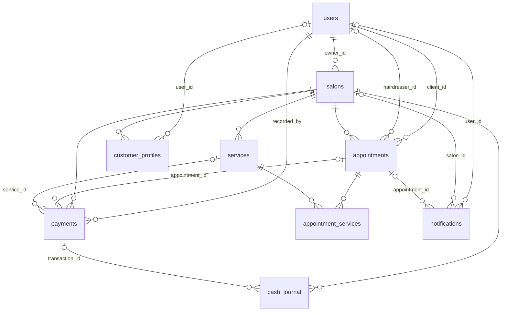

# backend/ — API CoifLink (FastAPI)

API REST du backend CoifLink, conformément à **[ADR-0003](../docs/adr/0003-backend-fastapi.md)**
(FastAPI · Python · REST + JWT). Le socle (issues #2–#6) installe l'architecture hexagonale,
la CI, le schéma PostgreSQL et la politique de secrets. L'**inscription client** (US-1.1, #8) et l'**inscription gérant** (#9) sont les deux premières
fonctionnalités M1 livrées (salons, RDV, caisse, connexion JWT… continuent en M1→).

## Architecture (hexagonale — [ADR-0008](../docs/adr/0008-architecture-hexagonale.md))

```
coiflink_api/
  domain/         # entités & règles métier (zéro dépendance framework/I/O)
  application/    # cas d'usage
    ports/        # interfaces (typing.Protocol)
  adapters/
    inbound/      # driving : routers HTTP FastAPI (ex. health.py → /health)
    outbound/     # driven : Postgres, Redis, S3, FCM/SMS (implémentent les ports)
  main.py         # composition root : assemble l'app + monte les routers
```

La dépendance va toujours **vers l'intérieur** ; toute brique externe passe par un
**port** + un adapter sortant (jamais d'import direct d'un client d'infra depuis le domaine).

## Prérequis

- **Python ≥ 3.12** (version de référence figée par #2 — cf. [ADR-0007](../docs/adr/0007-arborescence-monorepo-versions.md)).

## Installation (environnement isolé)

```bash
cd backend
python -m venv .venv
source .venv/bin/activate          # Windows : .venv\Scripts\activate
pip install -e ".[dev]"            # installe l'API + les outils de test
```

## Lancement (dev)

```bash
cp .env.example .env               # ignoré par git ; renseigner localement (aucun secret committé)
uvicorn coiflink_api.main:app --reload
```

L'API écoute alors sur `http://127.0.0.1:8000`. Endpoint de santé :

```bash
curl http://127.0.0.1:8000/health   # -> {"status":"ok"}
```

## Build & test

| Action | Commande |
| --- | --- |
| **Build** (installation du paquet) | `pip install -e .` |
| **Test** (test gate, cf. #6) | `pytest` |
| **Lint** (CI #4, cf. [ADR-0010](../docs/adr/0010-ci-cd-docker-packaging.md)) | `ruff check .` (installé via l'extra `dev`) |
| **Image Docker** (build-seul en CI ; config par env, non-root) | `docker build -t coiflink-backend ./backend` |

## Endpoints

| Méthode | Chemin | Réponse | Rôle |
| --- | --- | --- | --- |
| `GET` | `/health` | `{"status":"ok"}` | Sonde de santé (adapter entrant `adapters/inbound/health.py`) — aucune logique métier |
| `POST` | `/auth/register` | `201` + utilisateur (sans secret) | Inscription client (`role=CLIENT`, US-1.1, #8) — voir ci-dessous |
| `POST` | `/auth/register/manager` | `201` + utilisateur (sans secret) | Inscription gérant (`role=MANAGER`, #9) — voir ci-dessous |

## Authentification — inscription client (US-1.1, #8)

`POST /auth/register` crée un **compte client** (`role=CLIENT`, `status=ACTIVE`) à partir d'un
**nom**, d'un **numéro de téléphone** et d'un **mot de passe** (e-mail optionnel). Adapter entrant :
`adapters/inbound/auth.py` ; cas d'usage : `application/registration.py` (architecture hexagonale,
[ADR-0008](../docs/adr/0008-architecture-hexagonale.md)). Décisions de sécurité actées par
**[ADR-0012](../docs/adr/0012-hachage-argon2-strategie-otp.md)**.

- **Requête** (JSON) : `full_name` (requis), `phone` (requis), `password` (requis, ≥ 8 caractères),
  `email` (optionnel).
- **`201 Created`** : `{ id, full_name, phone, email, role, status, created_at }`. La réponse
  n'expose **jamais** `password` ni `password_hash`.
- **`409 Conflict`** : le numéro de téléphone (ou l'e-mail) est **déjà inscrit** (doublon refusé).
- **`422 Unprocessable Entity`** : validation (téléphone/mot de passe/e-mail invalides, champ manquant).

L'inscription **n'émet aucun JWT** (la connexion est l'issue #10).

**Sécurité & vie privée :**
- **Mot de passe jamais en clair** : haché par **argon2id** (`argon2-cffi`, pas de troncature 72 octets)
  derrière le port `PasswordHasher`. Le clair n'est **ni journalisé ni renvoyé**.
- **Normalisation du téléphone** en **E.164** (indicatif Côte d'Ivoire `+225` par défaut) : garantit
  l'unicité (`uq_users_phone`) — sans forme canonique, le refus de doublon serait contournable.
- **Refus de doublon** garanti à deux niveaux : pré-vérification applicative **et** contrainte base
  (course concurrente retraduite en `409`).
- **OTP** : logique de génération/vérification **pure et testable** (RNG + horloge injectés, usage
  unique, expiration, limite d'essais). **Désactivé par défaut** (`OTP_ENABLED=false`) ; l'envoi SMS
  réel est **différé** à M5 ([ADR-0006](../docs/adr/0006-notifications-fcm-sms.md)) — l'adapter de #8
  est un **stub** qui ne journalise rien. Le code OTP n'est **jamais** renvoyé ni journalisé.
- **PII** (`full_name`, `phone`, `email`) et secrets ne sont **jamais** journalisés (PRD §11.1/§11.3).

## Authentification — inscription gérant (#9)

`POST /auth/register/manager` crée un **compte propriétaire de salon** (`role=MANAGER`,
`status=ACTIVE`) à partir des **mêmes champs** que le client (`full_name`, `phone`, `password`,
`email` optionnel) et avec les **mêmes règles** (hachage **argon2id**, normalisation du téléphone,
refus de doublon à deux niveaux, OTP désactivé par défaut). Le compte est alors **prêt à créer un
salon** (`salons.owner_id → users.id`, issue #15). Même adapter (`adapters/inbound/auth.py`) et même
cas d'usage généralisé (`RegisterUser`, `application/registration.py`) que l'inscription client.

- **Requête** / **`201`** / **`409`** / **`422`** : **identiques** à l'inscription client (voir
  ci-dessus). La réponse porte `role: "MANAGER"` et n'expose **jamais** de secret.
- **Rôle attribué côté serveur — anti-élévation de privilège (label `security`)** : le rôle
  `MANAGER` est déterminé par le **chemin d'inscription** (endpoint + assemblage), **jamais** par un
  champ de la requête. Défense en profondeur : (1) `RegisterRequest` **ne déclare pas** de champ
  `role` ; (2) `extra="forbid"` → tout champ superflu (p. ex. un `role` injecté) provoque un `422` au
  lieu d'être ignoré ; (3) **liste blanche** de domaine `SELF_REGISTERABLE_ROLES = {CLIENT, MANAGER}`
  au niveau du cas d'usage (un `ADMIN`/`HAIRDRESSER` n'est **jamais** auto-inscriptible).
- **Hors périmètre #9** : l'inscription gérant **n'émet aucun JWT** (connexion = #10) et **ne crée
  aucun salon** (US-2.1 = #15). L'attribution du rôle ne donne **aucun** accès protégé tant que le
  RBAC (#12) n'est pas en place. Aucune migration : `MANAGER` est déjà une valeur acceptée par la
  contrainte `ck_users_role` de la table `users` (#3).

## Configuration

La configuration est lue **depuis l'environnement** (jamais en dur). Voir `.env.example` ;
les **secrets réels** (DSN base/Redis, `JWT_SECRET`, etc.) sont injectés **hors dépôt** et ne doivent
**jamais** être committés. Modèle d'environnements, matrice de configuration et politique de secrets :
**[docs/environnements-et-secrets.md](../docs/environnements-et-secrets.md)** (ADR-0011).

| Variable | Défaut | Rôle |
| --- | --- | --- |
| `OTP_ENABLED` | `false` | Active l'OTP à l'inscription (#8). Envoi réel différé à M5 ; capacité testable même désactivée. |
| `OTP_CODE_LENGTH` | `6` | Longueur du code OTP (optionnel). |
| `OTP_TTL_SECONDS` | `300` | Durée de validité de l'OTP en secondes (optionnel). |
| `OTP_MAX_ATTEMPTS` | `3` | Nombre d'essais autorisés par OTP (optionnel). |
| `JWT_SECRET` | *(vide)* | **Non utilisé par #8** ; requis dès l'émission de jetons (connexion, #10). |

## Modèle de données & migrations

Le schéma relationnel initial (issue #3) matérialise les **8 entités du PRD §9** plus une
table de jonction, avec leurs contraintes d'intégrité critiques. L'outillage est figé par
**[ADR-0009](../docs/adr/0009-orm-migrations-sqlalchemy-alembic.md)** : **SQLAlchemy 2.0**
(ORM, style typé `Mapped[...]`) · **Alembic** (migrations versionnées) · **psycopg 3**
(driver) · **PostgreSQL 16**.

Conformément à l'hexagonal (ADR-0008), tables ORM, `metadata` et migrations sont un **détail
de persistance** et vivent dans `adapters/outbound/` ; seules les **énumérations métier** sont
des `enum.Enum` purs du `domain/`. Aucun import de SQLAlchemy depuis `domain/` ou
`application/`.

```
coiflink_api/
  domain/enums.py                          # enums purs (Role, AppointmentStatus, ...) — source des CHECK
  adapters/outbound/persistence/
    base.py                                 # DeclarativeBase + metadata + convention de nommage
    models.py                              # tables ORM (source de vérité du schéma)
    session.py                              # fabrique d'engine (lit DATABASE_URL ; non câblée à l'app en #3)
migrations/
  env.py                                    # importe la metadata ; lit DATABASE_URL (jamais de secret)
  versions/0001_schema_initial.py           # migration initiale up/down
alembic.ini                                 # config Alembic (DSN via env, aucun secret)
```

### Prérequis & connexion

- **PostgreSQL 16** accessible.
- `DATABASE_URL` défini dans l'environnement (cf. `.env.example`). Il pilote l'application
  **et** Alembic. La forme `postgresql://…` est automatiquement normalisée en
  `postgresql+psycopg://…` (driver psycopg 3) ; `alembic.ini` ne contient **aucun**
  identifiant.

### Commandes de migration

Exécutées depuis `backend/` (avec l'environnement virtuel activé et `DATABASE_URL` défini) :

| Commande | Effet |
| --- | --- |
| `alembic upgrade head` | Applique toutes les migrations (crée le schéma). |
| `alembic downgrade base` | Réverte tout (revient à un schéma vide). |
| `alembic current` | Affiche la révision appliquée. |
| `alembic history` | Liste l'historique des révisions. |
| `alembic check` | Vérifie que la `metadata` ORM correspond à la base (aucun diff attendu). |
| `alembic revision --autogenerate -m "…"` | Génère une nouvelle migration (à **relire** : les `CHECK`/`EXCLUDE` ne sont pas tous autogénérés). |

Le round-trip `upgrade head` → `downgrade base` → `upgrade head` est **réversible et
idempotent**.

### Diagramme relationnel (ERD)



### Dictionnaire des tables

> Toutes les tables portent `id UUID PK DEFAULT gen_random_uuid()` et `created_at timestamptz`.
> Celles qui sont mutables portent aussi `updated_at timestamptz`. Montants en `NUMERIC(12,2)`
> (devise XOF). Suppression par défaut `ON DELETE RESTRICT`.

| Table | Colonnes notables | Contraintes & index clés |
| --- | --- | --- |
| **`users`** | `full_name`, `phone`, `email?`, `password_hash`, `role`, `status` | `uq_users_phone` ; `uq_users_email` (unique partiel `WHERE email IS NOT NULL`) ; CHECK `role`/`status` |
| **`salons`** | `owner_id→users`, `name`, `description`, `phone`, `address`, `city`, `commune`, `latitude`, `longitude`, `logo_url`, `status`, `opening_hours JSONB` | FK `owner_id` ; CHECK `status` ; index `(city, commune)`, `status` |
| **`services`** | `salon_id→salons`, `name`, `price`, `duration_minutes`, `category`, `is_active` | FK `salon_id` ; `uq_services_salon_id (salon_id, id)` ; CHECK `price >= 0`, `duration_minutes > 0` ; index `salon_id` |
| **`appointments`** | `salon_id→salons`, `client_id→users`, `hairdresser_id?→users`, `appointment_date`, `start_time`, `end_time`, `status`, `cancellation_reason?`, `client_note?`, `slot` (généré) | FK `salon_id`/`client_id` NOT NULL (§8.1) ; `uq_appointments_salon_id (salon_id, id)` ; CHECK `end_time > start_time`, `status` ; **EXCLUDE** anti double-booking ; index `(salon_id, appointment_date)`, `client_id` |
| **`appointment_services`** *(jonction)* | `appointment_id→appointments`, `service_id→services`, `salon_id`, `price_at_booking` | PK `(appointment_id, service_id)` ; **FK composites** `(salon_id, appointment_id)` et `(salon_id, service_id)` (cohérence salon) ; `ON DELETE CASCADE` depuis le RDV ; CHECK `price >= 0` |
| **`customer_profiles`** | `salon_id→salons`, `user_id?→users`, `full_name`, `phone?`, `notes?`, `last_visit_at?`, `total_visits` | FK `salon_id`/`user_id` ; `uq_customer_profiles_salon_user (salon_id, user_id) WHERE user_id IS NOT NULL` ; CHECK `total_visits >= 0` ; index `salon_id` |
| **`payments`** | `salon_id→salons`, `appointment_id?`, `service_id?`, `client_id?→users`, `amount`, `currency`, `payment_method`, `status`, `recorded_by→users`, `reference?` | FK `salon_id`/`recorded_by` NOT NULL (§8.2) ; FK composites vers RDV/prestation ; **CHECK `appointment_id IS NOT NULL OR service_id IS NOT NULL`** (§8.2) ; CHECK `amount >= 0`, `payment_method`, `status` ; index `(salon_id, created_at)`, `appointment_id` |
| **`cash_journal`** *(append-only)* | `salon_id→salons`, `transaction_id?→payments`, `operation_type`, `amount`, `performed_by→users`, `description?` | FK `salon_id`/`performed_by` NOT NULL ; `created_at` horodaté (§8.2) ; CHECK `operation_type` ; index `(salon_id, created_at)` |
| **`notifications`** | `user_id?→users`, `salon_id?→salons`, `appointment_id?→appointments`, `type`, `channel`, `title`, `message`, `status`, `sent_at?` | CHECK `type`/`channel`/`status` ; index `user_id`, `(salon_id, created_at)` |

### Contraintes clés métier

- **RDV → salon + ≥ 1 prestation (§8.1)** : `salon_id` NOT NULL ; la cardinalité « ≥ 1 »
  passe par la jonction `appointment_services`, garantie par insertion transactionnelle côté
  application (M3). Les **FK composites** `(salon_id, …)` interdisent de mêler des entités de
  salons différents (isolation §11.2).
- **Paiement → prestation ou RDV (§8.2)** : `CHECK (appointment_id IS NOT NULL OR service_id IS
  NOT NULL)`.
- **Anti double-réservation (§8.1)** : colonne générée `slot tsrange` (Abidjan = UTC+0) +
  `EXCLUDE USING gist (hairdresser_id WITH =, slot WITH &&)` restreinte aux RDV actifs
  (`PENDING`/`CONFIRMED`) assignés — requiert l'extension `btree_gist`.
- **Journal de caisse (§8.2)** : horodaté et conçu **append-only** (pas de `DELETE`/`UPDATE` ;
  correction = nouvelle ligne `ADJUSTMENT`/`REFUND`).
- **Pas de hard-delete d'un paiement validé (§8.2)** : `ON DELETE RESTRICT` + statut
  `CANCELLED`/`ADJUSTED`.

### Sécurité & données personnelles

`DATABASE_URL` et tout identifiant sont lus **depuis l'environnement** ; aucune valeur réelle
n'est committée (seul `.env.example`). Les colonnes PII (`users`, `customer_profiles`) et le
`password_hash` (jamais de mot de passe en clair) ne doivent **jamais** être journalisés —
les logs Alembic ne dumpent pas de données.

### Tests

Les invariants de schéma (sans base) et le round-trip de migration (PostgreSQL requis,
**skip si aucun `DATABASE_URL`**) sont couverts par la suite de tests. Issue #5 ajoute
`test_session.py` (fail-fast sur `DATABASE_URL`, normalisation du DSN — aucune infra requise)
et `test_secrets_policy.py` (vérifications statiques sur `.gitignore`, `.env.example`,
`docker-compose.yml`, configs Railway et Dockerfiles). La CI (#4) et les environnements &
secrets (#5) sont désormais en place.

Issue #8 complète la suite avec des **tests unitaires** (logique de domaine : téléphone,
mot de passe, OTP, hacheur argon2id), des **tests API** (`TestClient`, sans base réelle :
`201`, `409` doublon, `422` validation, non-fuite du mot de passe/OTP dans la réponse) et un
test de configuration. Les tests d'**intégration Postgres** (persistance réelle +
contrainte `uq_users_phone`) sont inclus et **skippés proprement si `DATABASE_URL` est absent**.

Issue #9 étend la suite avec des **tests API gérant** (`test_auth_manager_api.py`, `TestClient` :
`201` + `role="MANAGER"`, non-fuite de secret, `409` doublon, `422` validation, anti-injection
de rôle — label `security`) ; des tests unitaires du cas d'usage généralisé
(`test_registration_usecase.py` : `role=MANAGER`, garde-fou `RoleNotSelfRegisterable`, liste
blanche `SELF_REGISTERABLE_ROLES`) ; et des **tests d'intégration Postgres gérant**
(`test_manager_postgres_integration.py` : contrainte `ck_users_role`, `uq_users_phone`, flux
complet) — **skippés proprement si `DATABASE_URL` est absent**.
